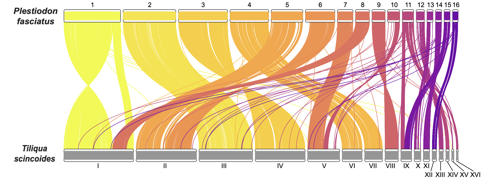

# **Plotting Synteny**

## Generating Busco Locations with [Compleasm](https://github.com/huangnengCSU/compleasm)
Since the genomes I am comparing don't have the same number of chromosomes, I am using the synteny of BUSCO genes.

To generate the location of BUSCO genes quickly, run Compleasm as follows: 
```
#!/bin/sh
#SBATCH --job-name compleasm
#SBATCH --nodes=1
#SBATCH --tasks-per-node=8
#SBATCH --mem=50gb
#SBATCH --time=5:00:00
#SBATCH --mail-type=ALL
#SBATCH --mail-user=jhoffman1@amnh.org

source ~/.bash_profile
conda activate compleasm

GENOME="/path/to/genome.fasta"
OUT="/path/to/outdirectory"
LINEAGE="busco_lineage" #i.e. sauropsida

echo $GENOME

compleasm run -a $GENOME -o $OUT -t $SLURM_NTASKS_PER_NODE -l $LINEAGE
```

The output we're after is full_table_busco_format.tsv

## Text File Organization
In order to run RIdeogram to make the plots, we need to create two .txt files. 

The first file is the dual_karyotype.txt file with the following format where
Chr = Chromosome number label
Start = Start of chromosome (in bps)
End = End of chromosome (in bps)
fill = hexadecimal color code for the fill of the chromosome idiogram
species = species label
size = size of species label
color = hexadecimal color code for the species label
```
Chr	Start	End	fill	species	size	color
1	1	244253184	f0f921	Plestiodon	12	252525
2	1	227050938	f7e225	Plestiodon	12	252525
3	1	212007450	fccd25	Plestiodon	12	252525
4	1	166278287	feb72d	Plestiodon	12	252525
5	1	136495205	fca338	Plestiodon	12	252525
6	1	127105332	f79044	Plestiodon	12	252525
7	1	66997294	f07f4f	Plestiodon	12	252525
8	1	60016561	e76e5b	Plestiodon	12	252525
9	1	56584554	dd5e66	Plestiodon	12	252525
10	1	52432282	d14e72	Plestiodon	12	252525
11	1	48911944	c5407e	Plestiodon	12	252525
12	1	35513580	b6308b	Plestiodon	12	252525
13	1	25995680	a72197	Plestiodon	12	252525
14	1	25905858	9511a1	Plestiodon	12	252525
15	1	25656153	8305a7	Plestiodon	12	252525
16	1	24129074	6e00a8	Plestiodon	12	252525
I	1	314321002	969696	Tiliqua	12	252525
II	1	272452919	969696	Tiliqua	12	252525
III	1	242160784	969696	Tiliqua	12	252525
IV	1	224939789	969696	Tiliqua	12	252525
V	1	144324286	969696	Tiliqua	12	252525
VI	1	90008927	969696	Tiliqua	12	252525
VII	1	80219437	969696	Tiliqua	12	252525
VIII	1	60441843	969696	Tiliqua	12	252525
IX	1	48696318	969696	Tiliqua	12	252525
X	1	29826511	969696	Tiliqua	12	252525
XI	1	28116240	969696	Tiliqua	12	252525
XII	1	19799884	969696	Tiliqua	12	252525
XIII	1	18786920	969696	Tiliqua	12	252525
XIV	1	15219262	969696	Tiliqua	12	252525
XV	1	9630813	969696	Tiliqua	12	252525
XVI	1	8117729	969696	Tiliqua	12	252525
````

The next file is made from combining two Compleasm output full_table_busco_format.tsv.
Originally, the files look like this:
```
# Busco id	Status	Sequence	Gene Start	Gene End	Strand	Score	Length	OrthoDB url	Description
10000at8457	Complete	JANXHW010000003.1	197974332	198064610	-	4808	1000	https://v10-1.orthodb.org/?query=10000at8457	filamin A-interacting protein 1-like
10007at8457	Complete	JANXHW010000003.1	170319220	170322361	+	4422	836	https://v10-1.orthodb.org/?query=10007at8457	Zinc finger and BTB domain-containing protein 21
10012at8457	Complete	JANXHW010000007.1	48815564	48839282	-	2625	580	https://v10-1.orthodb.org/?query=10012at8457	Myosin head, motor domain
10014at8457	Complete	JANXHW010000006.1	95210214	95221500	-	4525	763	https://v10-1.orthodb.org/?query=10014at8457	WD repeat-containing protein mio
1001at8457	Complete	JANXHW010000007.1	813191	841593	-	6243	1953	https://v10-1.orthodb.org/?query=1001at8457	spatacsin
10020at8457	Complete	JANXHW010000006.1	97259198	97337047	-	4595	755	https://v10-1.orthodb.org/?query=10020at8457	Syndetin, C-terminal
```
The first step I did was to remove the following columns: Status, Strand, Score, Length, OrthoDB, url, and Description.
You should be left with Busco id, Gene Start, and Gene End.

Then, replace the Sequence names with their respective chromosome number. I used a find and replace code with a replacement file like so:
Ex replacement.txt:
chromosomename chromosomenumber
```
JANXHW010000001.1	1
JANXHW010000002.1	2
JANXHW010000003.1	3
```
```
while IFS=$'\t' read -r find replace; do
    perl -i.bak -pe "s/\b\Q$find\E\b/$replace/g" original.txt
done < replacement.txt
cp original.txt new.txt
```

From there, I used this excel command to combine the data based on Busco id
```
=XLOOKUP(A2, Sheet2!A:A, Sheet2!B:B, "Not Found") #Sequence
=XLOOKUP(A2, Sheet2!A:A, Sheet2!C:C, "Not Found") #Start
=XLOOKUP(A2, Sheet2!A:A, Sheet2!D:D, "Not Found") #End
```

Then, delete the Busco id column and rename the columns to match below:
```
Species_1	Start_1	End_1	Species_2	Start_2	End_2	fill
1	164810995	164859225	1	48882276	48937377	f0f921
1	160812908	160938123	1	52503442	52631250	f0f921
1	19032039	19089842	1	199946894	200000189	f0f921
1	47306138	47348443	1	170772592	170812746	f0f921
```
The fill column is for the color of the 'thread' that connects that busco gene. Here I just have them matching the chromosome they originate from. 

## Plot with [RIdeogram](https://cran.r-project.org/web/packages/RIdeogram/vignettes/RIdeogram.html)
Once that is complete, run RIdeogram to make the figure.
```
#Install
devtools::install_github('TickingClock1992/RIdeogram')

#set working directory
setwd("/Users/jonhoffman/AMNH")

#call Ideogram
library(RIdeogram)

#Read in the karyotype file and synteny file
kary <- read.table("dual_karyotype2.txt", header = T)
synt <- read.table("til-pfas_synteny.txt", header = T)

#create ideogram (saved to wd as a .svg)
ideogram(karyotype = kary, synteny = synt)

#convert saved svg to png
convertSVG("chromosome.svg", device = "png")
```

The result should look like this: 


